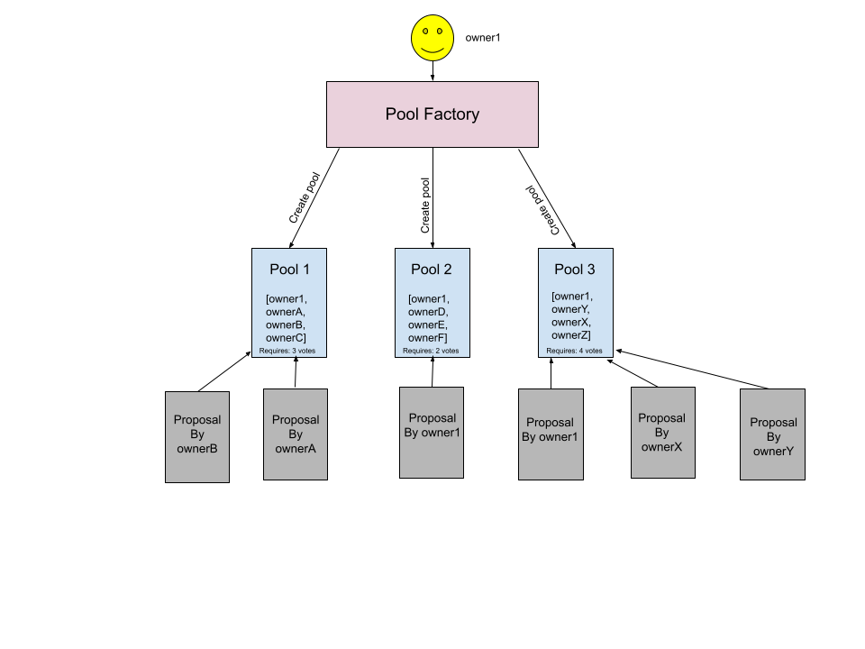

# 1pools 🏊‍♂️ – Harmony One Hackathon 

## What is it?
**Pooling service that allows groups to use the ONE token to delegate cash flow collectively using multisig wallets.**
<br></br>
More specifically, the purpose of this project is to explores the utility of Harmony One's cross chain interoperability of bridging any Proof-of-Work and Proof-of-Stake chains by building a realistic DeFi application. Currently, we have a great variety of financial services such as Venmo, PayPal, etc to choose from but a common theme amongst these services is that there is usually only one "delegate", where one person is in charge of all the funds. We wanted to expand on the idea of decentrailized finance to better fit our day to day scenarios and allow everyone that is apart of a group an equal stance by using a voting system.

## smart contract
### High Overview
The current smart contract follows a factory pattern with an underlying multisig wallet contract, using solidity version `0.8.7` and up. The `PoolFactory.sol` contract is used for calling the `Pools` constructor and instantiating pools, it also keeps track of all the created pool address of a given owner along with the creator. The `Pools.sol` contract is mainly used for regulating the state of all the proposals of a given pool. These proposals allow different liquidity functionalities of the wallet's funds proposed by an owner and thus allow the participants to cast their votes. The users then have the freedom to decide how many confirmation is needed for a proposal to pass. Once the number of confirmations required is met, the amount in the proposal will be sent a delegated owner set in the proposal. 



### Testing and Deployment 
To try out the smart contracts, one can use an online solidity IDE: [**remix**](https://remix.ethereum.org/). Note: to use the pool created from `PoolFactory.sol` one would have to use that pool address upon deploying `Pools.sol` 
<br></br>
Deploy to testnet using Truffle:
1. install harmony packages 
```
npm install --save @harmony-js/core
npm install --save @harmony-js/core
npm install --save @harmony-js/core
npm install --save @harmony-js/utils
```
2. download harmony one wallet chrome extension and create `.env` with mnemonic and private key, for more information check out [harmony one documentation](https://docs.harmony.one/home/developers/deploying-on-harmony/truffle/setup)
3. edit `truffle-config.js` and set the appropriate version number for the compilers block. 
4. `truffle migrate  --network testnet --reset`

## frontend/backend 

## TODOs/ Nice to Haves
- a locking feature to freeze funds from transfering out until a given date 
- expiration date for proposal to reduce out of date proposal from execution 
